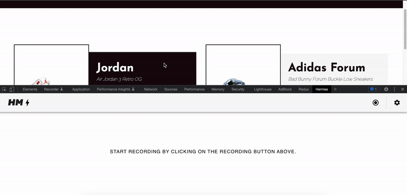

# Hermes-io Inspector 🔍
Chrome extension that allows inspect and debug in detail events emitted by [hermes-io.js](https://www.npmjs.com/package/hermes-io#get-started) in a friendly UI.
### Features
 - Record events
 - Play one or many events recorded previously
 - Inspect source code
 - Copy record payload
  
 Install from chrome web store [here](https://chrome.google.com/webstore/detail/hermes-io/pjdkgcpikfmkncldipldmimanfkpeedm?hl=en)
 ### Installation

 #### Clone the repo 
 ```
   git clone https://github.com/Maxtermax/hermes-io-devtools.git
 ```
 #### Install dependencies  
 ```
   npm i
 ```
 #### Run build command
 
 ```
   npm run build
 ```
Then go to: ```chrome://extensions``` and load the extension by clicking on button ```load unpackaged``` then select the repos folder.

Then try the demo: https://sneaker-store-1.vercel.app/ 



If you find me work helpful please consider support me at https://www.buymeacoffee.com/maxtermax, that encourage me to continue working on cool open source projects.
